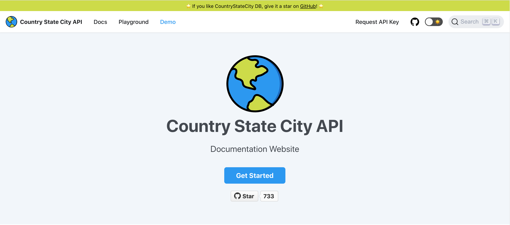

# 🌍 Countries States Cities Database


Full Database of city state country available in JSON, SQL, XML, YAML & CSV format.
All Countries, States & Cities are Covered & Populated with Different Combinations & Versions.
## API 🚀
🎉 Introducing **API** for Countries States Cities Database.

[API Documentation](https://countrystatecity.in/)

[](https://countrystatecity.in/)

## Available Formats
- JSON
- SQL
- XML
- YAML
- CSV

## Distribution Files Info
File | JSON | SQL | XML | YAML | CSV
:------------ | :-------------| :-------------| :------------- |:-------------|:-------------
Countries | :white_check_mark: | :white_check_mark: | :white_check_mark: | :white_check_mark: | :white_check_mark:
States | :white_check_mark: | :white_check_mark: | :white_check_mark: | :white_check_mark: | :white_check_mark:
Cities | :white_check_mark: | :white_check_mark: | :white_check_mark: | :white_check_mark: | :white_check_mark:
Country+States | :white_check_mark: | NA | :white_check_mark: | :white_check_mark: | NA
Country+Cities | :white_check_mark: | NA | :white_check_mark: | :white_check_mark: | NA
State+Cities | :white_check_mark: | NA | :white_check_mark: | :white_check_mark: | NA
Country+State+Cities/World | :white_check_mark: |  :white_check_mark: | :white_check_mark: | :white_check_mark: | NA

## Demo
https://dr5hn.github.io/countries-states-cities-database/

## Insights
Total Countries : 250 <br>
Total States/Regions/Municipalities : 4,964 <br>
Total Cities/Towns/Districts : 148,029 <br>

Last Updated On : 13th March 2022

## When's the next API Database Update day?
I usually update API's database once a quarter.

**Upcoming API Database Update Date:** 17th April 2022

**Please Note:** Even if you've urgency or you're running this API in Production and you find some data missing, the API Database update dates won't be changed at any circumstances.

## License
This **Countries States Cities Database** is made available under the [Open Database License](https://github.com/dr5hn/countries-states-cities-database/blob/master/LICENSE). Any rights in individual contents of the database are licensed under the [Database Contents License](https://github.com/dr5hn/countries-states-cities-database/blob/master/.github/CONTENT_LICENSE).

## Make the world more Greener 🌴
Contribute towards better earth [**buy the world a tree**](https://ecologi.com/darshangada?r=60f2a36e67efcb18f734ffb8)

## Contributions
[Contibution Guidelines](https://github.com/dr5hn/countries-states-cities-database/blob/master/.github/CONTRIBUTING.md)

## Other Publishings
Find this project on [data.world](https://data.world/dr5hn/country-state-city)

## Follow me at
<a href="https://github.com/dr5hn/"></a> <a href="https://twitter.com/dr5hn/"></a> <a href="https://www.linkedin.com/in/dr5hn/"></a>

## 🙋‍♂️ Support My Work
<p>
  <a href="https://www.paypal.me/dr5hn" target="_blank">
      
  </a>
  <a href="https://ko-fi.com/dr5hn" target="_blank">
      
  </a>
</p>

[](https://opencollective.com/countries-states-cities#backers)


## Suggestions / Feedbacks
```
Suggestions & Feedbacks are Most Welcome
gadadarshan[at]gmail[dot]com
```

That's all Folks. Enjoy.
