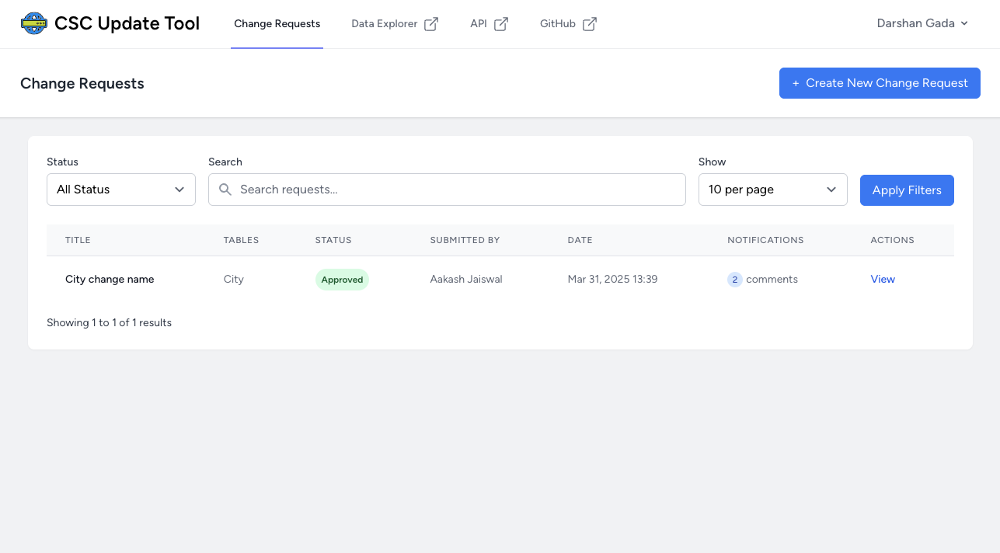

# 🌍 Countries States Cities Database
[](https://github.com/dr5hn/countries-states-cities-database/blob/master/LICENSE)
[](https://github.com/dr5hn/countries-states-cities-database/stargazers)
[](https://github.com/dr5hn/countries-states-cities-database/network)


Full Database of city state country available in JSON, MYSQL, PSQL, SQLITE, XML, YAML, MONGODB & CSV format.
All Countries, States & Cities are Covered & Populated with Different Combinations & Versions.

## Table of Contents

- [CSC Platform Ecosystem](#csc-platform-ecosystem)
- [API](#api-)
- [Export Tool](#-export-tool)
- [Available Formats](#available-formats)
- [Distribution Files Info](#distribution-files-info)
- [Demo](#demo)
- [Insights](#insights)
- [Next API Database Update](#next-api-database-update)
- [Import MongoDB](#import-mongodb)
- [License](#license)
- [Contributing](#contributing)
- [Repo Activity](#repo-activity)
- [Sponsors](#sponsors)
- [Other Publishings](#other-publishings)
- [Support My Work](#-support-my-work)
- [Suggestions / Feedbacks](#suggestions--feedbacks)
- [Disclaimer](#disclaimer)

## 🌐 CSC Platform Ecosystem

Easily access all the tools and services in the Countries States Cities platform:

| Tool            | Description                                      | Link                                      |
|-----------------|--------------------------------------------------|-------------------------------------------|
| **Demo Database** | Browse the full database online                  | [demo.countrystatecity.in](https://demo.countrystatecity.in/) |
| **API Service**   | Programmatic access to countries, states, cities | [countrystatecity.in](https://countrystatecity.in/)           |
| **Export Tool**   | Export data in multiple formats                  | [export.countrystatecity.in](https://export.countrystatecity.in/) |
| **Update Tool**   | Submit and track data change requests            | [manager.countrystatecity.in](https://manager.countrystatecity.in/) |

## API 🚀

🎉 Introducing **API** for Countries States Cities Database.

[API Documentation](https://countrystatecity.in/)

[](https://countrystatecity.in/)

## 🛠️ Export Tool

🎯 **Transform your data with our powerful export tool!**

Looking to export the Countries States Cities database in your preferred format? Our dedicated export tool makes it easy to convert and download data in multiple formats with just a few clicks.

**[Try the Export Tool](https://export.countrystatecity.in/)** - Export data in JSON, CSV, XML, YAML, and more!

[](https://export.countrystatecity.in/)

### Features:
- **Multiple Export Formats**: JSON, CSV, XML, YAML, and more
- **Flexible Data Selection**: Choose specific countries, states, or cities
- **Custom Filtering**: Filter by regions, subregions, or specific criteria
- **Bulk Downloads**: Export large datasets efficiently
- **Real-time Processing**: Get your data instantly
- **User-friendly Interface**: Simple and intuitive design

Perfect for developers, researchers, and businesses who need clean, structured geographical data for their applications.

## Available Formats

- JSON
- MYSQL
- PSQL
- SQLITE
- SQLSERVER
- MONGODB
- XML
- YAML
- CSV

## Distribution Files Info

| File                       | JSON | MYSQL | PSQL | SQLITE | SQLSERVER | MONGODB | XML | YAML | CSV |
| :------------------------- | :--- | :---- | :--- | :----- | :-------- | :------ | :-- | :--- | :-- |
| Regions                    | ✅   | ✅    | ✅   | ✅     | ✅        | ✅      | ✅  | ✅   | ✅  |
| Subregions                 | ✅   | ✅    | ✅   | ✅     | ✅        | ✅      | ✅  | ✅   | ✅  |
| Countries                  | ✅   | ✅    | ✅   | ✅     | ✅        | ✅      | ✅  | ✅   | ✅  |
| States                     | ✅   | ✅    | ✅   | ✅     | ✅        | ✅      | ✅  | ✅   | ✅  |
| Cities                     | ✅   | ✅    | ✅   | ✅     | ✅        | ✅      | ✅  | ✅   | ✅  |
| Country+States             | ✅   | NA    | NA   | NA     | NA        | NA      | NA  | NA   | NA  |
| Country+Cities             | ✅   | NA    | NA   | NA     | NA        | NA      | NA  | NA   | NA  |
| Country+State+Cities/World | ✅   | ✅    | ✅   | ✅     | ✅        | ✅      | NA  | NA   | NA  |

## Demo

https://dr5hn.github.io/countries-states-cities-database/

## Insights

Total Regions : 6 <br>
Total Sub Regions : 22 <br>
Total Countries : 250 <br>
Total States/Regions/Municipalities : 5,038 <br>
Total Cities/Towns/Districts : 151,024 <br>

Last Updated On : 02th Aug 2025

## Next API Database Update

The API database is regularly updated to ensure the latest data is available to users. The next scheduled update is on:

**Upcoming API Database Update Date:** 8th April 2025

Please note that this date is subject to change based on unforeseen circumstances. Although we strive to adhere to the schedule, there may be instances where the update date is missed. We apologize for any inconvenience caused in such cases.

We appreciate your understanding and patience. Thank you for using the Countries States Cities Database!

## Import MongoDB

How to import MongoDB database?

```bash
# First extract the tar.gz file
tar -xzvf world-mongodb-dump.tar.gz

# Then restore the MongoDB dump
mongorestore --host localhost:27017 --db world mongodb-dump/world
```

## License

This **Countries States Cities Database** is made available under the [Open Database License](https://github.com/dr5hn/countries-states-cities-database/blob/master/LICENSE). Any rights in individual contents of the database are licensed under the [Database Contents License](https://github.com/dr5hn/countries-states-cities-database/blob/master/.github/CONTENT_LICENSE).

## Contributing

👍🎉 First off, thanks for your interest in contributing! 🎉👍

### Using Our Database Update Tool

We've launched a dedicated web tool to make contributing to this database easier than ever!

**[CSC Update Tool](https://manager.countrystatecity.in/)** - Our official tool to submit database change requests

[](https://manager.countrystatecity.in/)

The update tool allows you to:

- Browse and search through all regions, subregions, countries, states, and cities
- Easily identify and correct outdated or inaccurate data
- Submit change requests through a streamlined review process
- Track the status of your submissions

### Alternative Manual Process

If you prefer to contribute directly through GitHub, you can still follow these steps:

1. Fork the repository and clone it to your local machine
2. Make the necessary changes to the data:
   - To fix cities records, update the `sql/world.sql` > cities Table
   - To fix states/provinces records, update the `sql/world.sql` > states Table
   - To fix countries records, update the `sql/world.sql` > countries Table
   - To fix regions records, update the `sql/world.sql` > regions Table
   - To fix subregions records, update the `sql/world.sql` > subregions Table
3. Once you've made the changes, create a pull request with a clear description of the modifications you've made

Please ensure your contributions align with our data standards and formatting. You can find the detailed contribution guidelines [here](https://github.com/dr5hn/countries-states-cities-database/blob/master/.github/CONTRIBUTING.md).

We review all submissions carefully to maintain data quality and appreciate your help in making this database more accurate and comprehensive.

## Repo Activity


As always, thanks to our amazing contributors!

<a href="https://github.com/dr5hn/countries-states-cities-database/graphs/contributors">
  
</a>

Made with [contrib.rocks](https://contrib.rocks).

## Sponsors

<p align="center">
  <a href="https://cdn.jsdelivr.net/gh/dr5hn/static/sponsors.svg">
    
  </a>
</p>

## Make the world more Greener 🌴

Contribute towards better earth [**buy the world a tree**](https://ecologi.com/darshangada?r=60f2a36e67efcb18f734ffb8)

## Other Publishings

Find this project on

* [data.world](https://data.world/dr5hn/country-state-city)
* [kaggle](https://www.kaggle.com/datasets/darshangada/countries-states-cities-database/data)

## Follow me at

<a href="https://github.com/dr5hn/"></a> <a href="https://twitter.com/dr5hn/"></a> <a href="https://www.linkedin.com/in/dr5hn/"></a>

## 🙋‍♂️ Support My Work

[](https://github.com/sponsors/dr5hn)

[](https://ko-fi.com/dr5hn)

## Suggestions / Feedbacks

```
Suggestions & Feedbacks are Most Welcome
gadadarshan[at]gmail[dot]com
```

## Disclaimer

Please note that while every effort has been made to ensure the accuracy and completeness of the Countries States Cities Database, it may still contain errors or omissions. The database is continuously being refined and improved based on user feedback and contributions.

Contributors are encouraged to review the Contribution Guidelines and follow the specified guidelines for updating and correcting data in the database. However, due to the collaborative nature of the project, we cannot guarantee the absolute accuracy or reliability of the information provided.

The Countries States Cities Database is made available under the Open Database License, and any rights in individual contents of the database are licensed under the Database Contents License. Users are responsible for independently verifying the data and using it at their own discretion.

We appreciate the efforts of contributors in identifying and addressing issues in the database, and we encourage users to report any inaccuracies or suggest improvements through creating issues. However, please note that the database may not always reflect the latest geopolitical changes or political status.

It is recommended that users consult official sources and corroborate the data from the Countries States Cities Database with other reliable references for critical applications or decision-making processes.

By accessing and using the Countries States Cities Database, users acknowledge and agree to the aforementioned disclaimer and the terms of the Open Database License and the Database Contents License.

That's all Folks. Enjoy.
