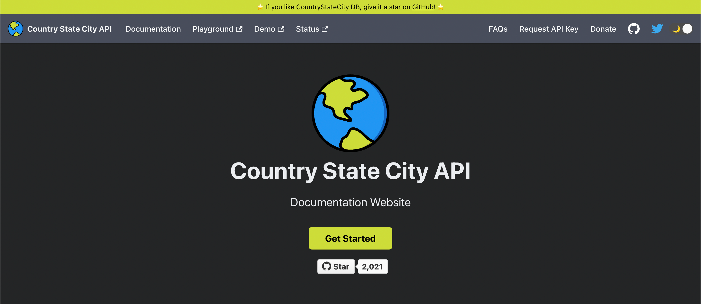

# 🌍 Countries States Cities Database
[](https://github.com/dr5hn/countries-states-cities-database/blob/master/LICENSE)
[](https://github.com/dr5hn/countries-states-cities-database/stargazers)
[](https://github.com/dr5hn/countries-states-cities-database/network)


Full Database of city state country available in JSON, MYSQL, PSQL, SQLITE, SQLSERVER, XML, YAML, MONGODB & CSV format.
All Countries, States & Cities are Covered & Populated with Different Combinations & Versions.

## Why Choose This Database?

* ✅ **Most Comprehensive** - 151,024+ cities from 250 countries with timezone & multilingual support (19 languages)
* ✅ **Multiple Integration Options** - NPM/PyPI packages, REST API, Export Tool, or direct downloads
* ✅ **Production Ready** - Trusted by thousands of developers, monthly updates
* ✅ **Every Format You Need** - JSON, SQL, MongoDB, CSV, XML, YAML - use what fits your stack
* ✅ **100% Free & Open Source** - ODbL licensed, no usage restrictions, developer-friendly

Save hundreds of hours collecting and maintaining geographical data. Get accurate, structured, ready-to-use data right now.

> **📦 Clone Tip:** Use `git clone --depth 1` for faster cloning (~1.2GB vs 5.4GB full history)

## Table of Contents
- [CSC Platform Ecosystem](#-csc-platform-ecosystem) • [Integration Methods](#-choose-your-integration-method) • [Official Packages](#-official-packages)
- [API](#api-) • [Export Tool](#️-export-tool) • [Available Formats](#available-formats)
- [Demo](#demo) • [Insights](#insights) • [Architecture](#repository-architecture)
- [Performance](#performance--benchmarks) • [License](#-license) • [Contributing](#contributing)
- [Platforms](#-available-on-multiple-platforms) • [Support](#️-support-my-work)

## 🌐 CSC Platform Ecosystem

Easily access all the tools and services in the Countries States Cities platform:

| Tool            | Description                                      | Link                                      |
|-----------------|--------------------------------------------------|-------------------------------------------|
| **NPM Package**   | Official JavaScript/TypeScript package           | [@countrystatecity/countries](https://www.npmjs.com/package/@countrystatecity/countries) |
| **Documentation** | Complete API documentation and guides           | [docs.countrystatecity.in](https://docs.countrystatecity.in/) |
| **Demo Database** | Browse the full database online                  | [demo.countrystatecity.in](https://demo.countrystatecity.in/) |
| **API Service**   | Programmatic access to countries, states, cities | [countrystatecity.in](https://countrystatecity.in/)           |
| **Export Tool**   | Export data in multiple formats                  | [export.countrystatecity.in](https://export.countrystatecity.in/) |
| **Update Tool**   | Submit and track data change requests            | [manager.countrystatecity.in](https://manager.countrystatecity.in/) |
| **Status Page**   | Real-time service uptime and incidents           | [status.countrystatecity.in](https://status.countrystatecity.in/) |

## 🔄 Choose Your Integration Method

| Method | Setup | Best For | Offline | Cost |
|--------|-------|----------|---------|------|
| **NPM/PyPI Package** | < 1 min | JS/TS/Python apps, offline use | ✅ | Free |
| **REST API** | < 5 min | Production apps, real-time data, any language | ❌ | Free tier + paid |
| **Export Tool** | < 2 min | Custom datasets, specific regions | ❌ | Free + credits |
| **Direct Download** | Immediate | SQL databases, one-time imports, legacy systems | ✅ | Free |

## 📦 Official Packages

### JavaScript/TypeScript (NPM)

```bash
npm install @countrystatecity/countries
```

**Features:** Zero dependencies, TypeScript support, offline-first, tree-shakeable

```javascript
import { Country, State, City } from '@countrystatecity/countries';
const usStates = State.getStatesOfCountry('US');
```

📖 [NPM Documentation](https://www.npmjs.com/package/@countrystatecity/countries) · 📂 [GitHub](https://github.com/dr5hn/countrystatecity)

### Python (PyPI)

```bash
pip install countrystatecity
```

**Features:** Easy-to-use Python interface, works with Django/Flask, offline data access

```python
from countrystatecity import Country, State, City
us_states = State.get_states_of_country('US')
```

📖 [PyPI Package](https://pypi.org/org/countrystatecity/) · 📂 [GitHub](https://github.com/dr5hn/countrystatecity-pypi)

### Timezones Package

Dedicated timezone data package for JavaScript/TypeScript applications:

```bash
npm install @countrystatecity/timezones
```

📂 [GitHub Repository](https://github.com/dr5hn/countrystatecity)

## API 🚀

🎉 Introducing **REST API** for Countries States Cities Database.

[API Documentation](https://docs.countrystatecity.in/)

[](https://countrystatecity.in/)

## 🛠️ Export Tool

**[Export Tool](https://export.countrystatecity.in/)** - Convert and download data in your preferred format

[](https://export.countrystatecity.in/)

**Features:** Multiple formats, flexible selection, custom filtering by region/country, bulk downloads, real-time processing

## Available Formats

- JSON
- MYSQL
- PSQL
- SQLITE
- SQLSERVER
- MONGODB
- XML
- YAML
- CSV

**Note:** DuckDB format is available via manual conversion from SQLite files. See the [Export to DuckDB](#export-to-duckdb) section for instructions.

## Distribution Files Info

| File                       | JSON | MYSQL | PSQL | SQLITE | SQLSERVER | MONGODB | XML | YAML | CSV |
| :------------------------- | :--- | :---- | :--- | :----- | :-------- | :------ | :-- | :--- | :-- |
| Regions                    | ✅🗜️ | ✅🗜️  | ✅   | ✅     | ✅        | ✅      | ✅🗜️ | ✅  | ✅🗜️ |
| Subregions                 | ✅🗜️ | ✅🗜️  | ✅   | ✅     | ✅        | ✅      | ✅🗜️ | ✅  | ✅🗜️ |
| Countries                  | ✅🗜️ | ✅🗜️  | ✅   | ✅     | ✅        | ✅      | ✅🗜️ | ✅  | ✅🗜️ |
| States                     | ✅🗜️ | ✅🗜️  | ✅   | ✅     | ✅        | ✅      | ✅🗜️ | ✅  | ✅🗜️ |
| Cities                     | ✅🗜️ | ✅🗜️  | ✅   | ✅     | ✅        | ✅      | ✅🗜️ | ✅  | ✅🗜️ |
| Country+States             | ✅🗜️ | NA    | NA   | NA     | NA        | NA      | NA  | NA   | NA  |
| Country+Cities             | ✅🗜️ | NA    | NA   | NA     | NA        | NA      | NA  | NA   | NA  |
| Country+State+Cities/World | ✅🗜️ | ✅🗜️  | ✅   | ✅     | ✅        | ✅      | NA  | NA   | NA  |

**Legend:** ✅ = Available | 🗜️ = Compressed (.gz) version also available


## Demo

https://dr5hn.github.io/countries-states-cities-database/

## Insights

Total Regions : 6 <br>
Total Sub Regions : 22 <br>
Total Countries : 250 <br>
Total States/Regions/Municipalities : 5,038 <br>
Total Cities/Towns/Districts : 151,024 <br>
Total Timezones : 423 (97.9% IANA coverage) <br>

Last Updated On : 18th Nov 2025

## Repository Architecture

**Two-phase build system:** JSON (version control) → MySQL (canonical) → All export formats

```
📝 contributions/ → [Python Import] → 🗄️ MySQL → [PHP Export] → 📦 json/, csv/, xml/, sql/, etc.
```

**For Contributors:** Edit JSON files in `contributions/` → Submit PR → GitHub Actions auto-generates all exports (no local setup needed!)

**For Maintainers:** MySQL as single source of truth, dynamic schema detection, one command to regenerate all formats

**For Users:** All formats guaranteed in sync, compressed downloads available (.gz)

## Import MongoDB

How to import MongoDB database?

```bash
# First extract the tar.gz file
tar -xzvf world-mongodb-dump.tar.gz

# Then restore the MongoDB dump
mongorestore --host localhost:27017 --db world mongodb-dump/world
```

## Export to DuckDB

Want to export the database to DuckDB format? You can easily convert the existing SQLite files to DuckDB format using our conversion script.

### Prerequisites

First, install DuckDB Python package:

```bash
pip install duckdb
```

### Convert SQLite to DuckDB

Use the provided conversion script to convert SQLite files to DuckDB format:

```bash
# Convert the complete world database
python3 bin/scripts/export/import_duckdb.py --input sqlite/world.sqlite3 --output duckdb/world.db

# Convert individual table databases
python3 bin/scripts/export/import_duckdb.py --input sqlite/regions.sqlite3 --output duckdb/regions.db
python3 bin/scripts/export/import_duckdb.py --input sqlite/subregions.sqlite3 --output duckdb/subregions.db
python3 bin/scripts/export/import_duckdb.py --input sqlite/countries.sqlite3 --output duckdb/countries.db
python3 bin/scripts/export/import_duckdb.py --input sqlite/states.sqlite3 --output duckdb/states.db
python3 bin/scripts/export/import_duckdb.py --input sqlite/cities.sqlite3 --output duckdb/cities.db
```

The conversion script will create DuckDB database files that maintain the same structure and data as the original SQLite files, optimized for analytical workloads.

## Performance & Benchmarks

### Export Performance
| Format | Export Time | World DB Size | Compressed (.gz) |
|--------|-------------|---------------|------------------|
| **CSV** | ~1s | 45 MB | 9 MB (fastest) |
| **JSON** | ~4s | 161 MB | 18 MB |
| **MongoDB** | ~1s | 140 MB | - |
| **SQL** | ~3s | 180 MB | 22 MB |
| **SQLite** | ~45s | 85 MB | - |
| **XML** | ~9s | 220 MB | 15 MB |
| **YAML** | ~17s | 195 MB | - |

### API Response Times (Average)
- Countries: ~50ms | States: ~180ms | Cities by State: ~80ms | Search: ~120ms

### System Requirements
- **Contributors**: Git + text editor (no local setup needed)
- **Maintainers**: PHP 8.0+, MySQL 5.7+, Python 3.8+, 4GB RAM, 10GB disk
- **End Users**: No requirements - just download!

## 📄 License

**[Open Database License (ODbL)](https://github.com/dr5hn/countries-states-cities-database/blob/master/LICENSE)** - 100% free and open source!

✅ Use commercially, modify freely, share openly • 📝 Just give credit and keep derivatives open

**Quick Attribution:**
```
Data by Countries States Cities Database
https://github.com/dr5hn/countries-states-cities-database | ODbL v1.0
```

## Contributing

### 🛠️ Easy Way: [CSC Update Tool](https://manager.countrystatecity.in/)
Use our web tool to browse, search, and submit data change requests with a streamlined review process.

[](https://manager.countrystatecity.in/)

### 📝 Manual Way: Edit JSON Files Directly

1. **Fork & clone**: `git clone --depth 1 https://github.com/YOUR_USERNAME/countries-states-cities-database.git`
2. **Edit files** in `contributions/` directory (cities, states, or countries)
3. **Omit** `id`, `created_at`, `updated_at`, `flag` fields (auto-managed)
4. **Include** required fields: `name`, `state_id`, `state_code`, `country_id`, `country_code`, `latitude`, `longitude`
5. **Submit PR** with clear description and data source

**Example city:**
```json
{
  "name": "San Francisco",
  "state_id": 1416,
  "state_code": "CA",
  "country_id": 233,
  "country_code": "US",
  "latitude": "37.77493",
  "longitude": "-122.41942",
  "timezone": "America/Los_Angeles"
}
```

📖 **Full guide**: [contributions/README.md](contributions/README.md) | [Contribution Guidelines](https://github.com/dr5hn/countries-states-cities-database/blob/master/.github/CONTRIBUTING.md)

**Note:** Only edit JSON in `contributions/` - GitHub Actions auto-generates all export formats!

## Repo Activity


As always, thanks to our amazing contributors!

<a href="https://github.com/dr5hn/countries-states-cities-database/graphs/contributors">
  
</a>

Made with [contrib.rocks](https://contrib.rocks).

## Sponsors

<p align="center">
  <a href="https://cdn.jsdelivr.net/gh/dr5hn/static/sponsors.svg">
    
  </a>
</p>

## Make the world more Greener 🌴

Contribute towards better earth [**buy the world a tree**](https://ecologi.com/darshangada?r=60f2a36e67efcb18f734ffb8)

## 🌐 Available On Multiple Platforms

Find and use this dataset across the web - choose the platform that fits your workflow:

| Platform | Best For | Access |
|----------|----------|--------|
| 📊 **[Kaggle Dataset](https://www.kaggle.com/datasets/darshangada/countries-states-cities-database/data)** | Data science, ML projects, notebooks | [Download on Kaggle](https://www.kaggle.com/datasets/darshangada/countries-states-cities-database/data) |
| 🗃️ **[Data.world](https://data.world/dr5hn/country-state-city)** | Data collaboration, business analytics | [View on Data.world](https://data.world/dr5hn/country-state-city) |
| 📦 **[NPM Registry](https://www.npmjs.com/package/@countrystatecity/countries)** | JavaScript/TypeScript developers | `npm install @countrystatecity/countries` |
| 🐙 **[GitHub](https://github.com/dr5hn/countries-states-cities-database)** | Contributors, raw files, issue tracking | [View Repository](https://github.com/dr5hn/countries-states-cities-database) |
| 🌍 **[API Service](https://countrystatecity.in/)** | Production apps, real-time access | [Get API Key](https://countrystatecity.in/) |
| 🛠️ **[Export Tool](https://export.countrystatecity.in/)** | Custom exports, specific formats | [Launch Tool](https://export.countrystatecity.in/) |
| 📊 **[Status Page](https://status.countrystatecity.in/)** | Service uptime monitoring, incidents | [Check Status](https://status.countrystatecity.in/) |


## Follow me at

<a href="https://github.com/dr5hn/"></a> <a href="https://twitter.com/dr5hn/"></a> <a href="https://www.linkedin.com/in/dr5hn/"></a>

## 🙋‍♂️ Support My Work

[](https://github.com/sponsors/dr5hn)

[](https://ko-fi.com/dr5hn)

## Suggestions / Feedbacks

```
Suggestions & Feedbacks are Most Welcome
gadadarshan[at]gmail[dot]com
```

## Disclaimer

While we strive for accuracy, this community-maintained database may contain errors or not reflect latest geopolitical changes. Users should verify critical data with official sources and use at their own discretion. Licensed under ODbL - see [LICENSE](https://github.com/dr5hn/countries-states-cities-database/blob/master/LICENSE) for details.

**Report issues**: [GitHub Issues](https://github.com/dr5hn/countries-states-cities-database/issues)

---

That's all Folks. Enjoy! 🌍
